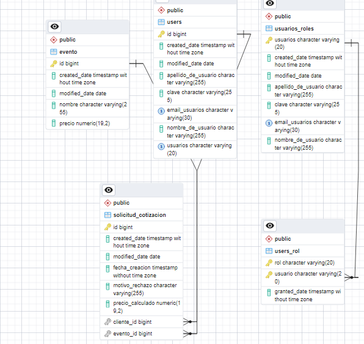

# Script DDL para Creación de Tablas y Restricciones

Este README proporciona una descripción y documentación básica del script DDL (Data Definition Language) que se utiliza para crear tablas en una base de datos PostgreSQL, junto con las restricciones de clave primaria y las relaciones entre las tablas. El script crea tres tablas relacionadas: `evento`, `solicitud_cotizacion`, `users`, y dos tablas relacionadas con roles: `users_rol` y `usuarios_roles`.

## Contenido del Script
El script DDL se encuentra en el archivo sin nombre proporcionado y contiene las siguientes partes:

1. Creación de la tabla evento: Esta sección define la estructura de la tabla `evento`, que almacena información sobre eventos. Incluye columnas como `id`, `created_date`, `modified_date`, `nombre` y `precio`. El `id` es una clave primaria autoincremental.

2. Creación de la tabla solicitud_cotizacion: Aquí se crea la tabla `solicitud_cotizacion`, que almacena detalles de las solicitudes de cotización relacionadas con eventos. Tiene columnas como `id`, `created_date`, `modified_date`, `fecha_creacion`, `motivo_rechazo`, `precio_calculado`, `cliente_id`, y `evento_id. cliente_id` y `evento_id` son claves foráneas que hacen referencia a las tablas `users` y `evento`, respectivamente. El `id` es una clave primaria autoincremental.

3. Creación de la tabla users: En esta sección se crea la tabla `users`, que almacena información de usuarios. Contiene columnas como `id`, `created_date`, `modified_date`, `apellido_de_usuario`, `clave`, `email_usuarios`, y `nombre_de_usuario`. `id` es la clave primaria y se definen restricciones únicas en las columnas `usuarios` y `email_usuarios`.

4. Creación de la tabla `users_rol`: Se crea la tabla users_rol que se utiliza para asignar roles a `usuarios`. Incluye columnas `rol`, `usuario`, y `granted_date`. Las columnas `rol` y `usuario` forman una clave primaria compuesta y son claves foráneas que hacen referencia a las tablas `usuarios_roles` y `users`, respectivamente.

5. Creación de la tabla `usuarios_roles`: Esta tabla almacena información adicional sobre `usuarios` y se utiliza en conjunto con la tabla `users_rol`. Contiene columnas como `usuarios`, `created_date`, `modified_date`, `apellido_de_usuario`, `clave`, `email_usuarios`, y `nombre_de_usuario`. La columna `usuarios` es la clave primaria, y se define una restricción única en la columna `email_usuarios`.

6. Restricciones de clave externa (Foreign Key Constraints): Se agregan restricciones de clave externa a la tabla `solicitud_cotizacion` para las columnas `evento_id` y `cliente_id`, que hacen referencia a las tablas evento y `users`, respectivamente. También se agrega una restricción de clave externa a la tabla `users_rol` para la columna `usuario`, que hace referencia a la tabla `usuarios_roles`.

7. El script concluye con un comando END; que marca el final de la transacción.

## Uso del Script
Para utilizar este script:

1. Asegúrese de tener una base de datos PostgreSQL disponible y haber iniciado sesión en ella.

2. Copie y pegue el contenido del script en una herramienta de administración de bases de datos PostgreSQL o guárdelo en un archivo .sql.

3. Ejecute el script en su base de datos PostgreSQL. Esto creará las tablas y las restricciones necesarias.

## Notas Adicionales
El script utiliza nextval para generar valores automáticos para las columnas id de las tablas.
Se definen restricciones únicas en las columnas `usuarios` y `email_usuarios` para garantizar que no haya duplicados en las tablas `users` y `usuarios_roles`.
Se utilizan claves foráneas para establecer relaciones entre las tablas `solicitud_cotizacion`, `users`, `evento`, `users_rol` y `usuarios_roles`, lo que permite mantener la integridad referencial de la base de datos.
Este script proporciona la estructura básica de las tablas y restricciones necesarias para una aplicación que almacena información sobre eventos, solicitudes de cotización y usuarios con roles. Puede personalizarse y expandirse según las necesidades específicas de su proyecto.